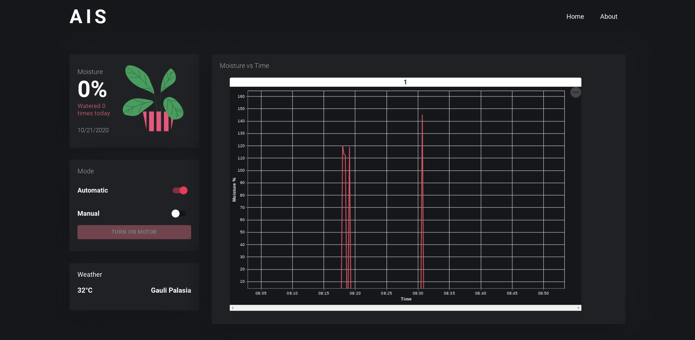

# AIS (Advanced Irrigation System)

## What is AIS ?

### AIS is a wifi enabled, smart plant watering system that uses [ESP](https://en.wikipedia.org/wiki/ESP32) and some other sensors to calculate the moisture value and smartly water your plants without any manual assistance.

## Features of AIS

- Provides a web portal to manage things.
- Visualizes soil moisture data.
- Automatic Mode
  - Automatically water the plant when moisture level goes below a certain threshold.
- Manual Mode
  - A simple switch to start and stop pump from anywhere in the world.
- Provides weather data based on user's current location.
- REST API created using [Flask(Python)](https://flask.palletsprojects.com/en/1.1.x/) and [Adafruit](https://io.adafruit.com/).
- Web Portal frontend using [ReactJS](https://reactjs.org/).

### You can check the demo [here](https://anuragtech02.github.io/ais-esp-flask).

 

# For Geeks

## Installation

### Clone

`git clone https://github.com/Anuragtech02/ais-esp-flask.git`
 

and install dependencies via

### `npm install`

This downloads all the [node](https://nodejs.org/en/) modules required for the project. 

### `npm start`

This opens up the project on the development server. 
Open [http://localhost:3000](http://localhost:3000) to view it in the browser.

The page will reload if you make edits. 

### Components Used

1. [ESP32](https://www.amazon.in/SquadPixel-ESP-32-Bluetooth-Development-Board/dp/B071XP56LM) or [ESP8266](https://www.amazon.in/Generic-Nodemcu-Esp8266-Internet-Development/dp/B07262H53W/ref=sr_1_1?dchild=1&keywords=esp8266&qid=1603281239&sr=8-1)</li>
2. [Soil Moisture Sensor](https://www.amazon.in/Robocraze-Moisture-Sensor-Module-Arduino/dp/B07FM41J4F/ref=sr_1_1_sspa?dchild=1&keywords=soil+moisture+sensor&qid=1603281348&sr=8-1-spons&psc=1&spLa=ZW5jcnlwdGVkUXVhbGlmaWVyPUExNjdVMklBTVBHTVZRJmVuY3J5cHRlZElkPUEwMzAzNzI0MUJCNVhMOVk5RU01NyZlbmNyeXB0ZWRBZElkPUEwODgxMjUwMVFIRlIxOFhYMzZLNSZ3aWRnZXROYW1lPXNwX2F0ZiZhY3Rpb249Y2xpY2tSZWRpcmVjdCZkb05vdExvZ0NsaWNrPXRydWU=)
3. [DC Motor Pump](https://www.amazon.in/Robotbanao-Mini-Micro-Submersible-Water/dp/B07FSHMT7K/ref=sr_1_12?dchild=1&keywords=5v+dc+motor&qid=1603281453&sr=8-12)
4. [Jumper Wires](https://www.amazon.in/Robocraze-Jumper-240pcs-Breadboard-Multicolored/dp/B07V45LXXX/ref=sr_1_1_sspa?dchild=1&keywords=jumper+wires&qid=1603281500&sr=8-1-spons&psc=1&spLa=ZW5jcnlwdGVkUXVhbGlmaWVyPUExU0xQNzhIMUg4NVpJJmVuY3J5cHRlZElkPUEwMDk2NjA0MVAyQzdVNE1FQU5CQiZlbmNyeXB0ZWRBZElkPUEwODMxNTE5MzJDVTlIQ1FPTU5ZVyZ3aWRnZXROYW1lPXNwX2F0ZiZhY3Rpb249Y2xpY2tSZWRpcmVjdCZkb05vdExvZ0NsaWNrPXRydWU=)
5. [LED](https://www.amazon.in/Electronicspices-Pack-White-Green-Yellow/dp/B07L8HZS2Q/ref=sr_1_7?dchild=1&keywords=led+project&qid=1603281525&sr=8-7)

And that's it! It will work :)

#### Check [PPT](https://docs.google.com/presentation/d/e/2PACX-1vQUzKKeies5fv7kOCKvTvdljbJeygBn959Wqw7gcI6cmUk8JOvamQehKbmYwS7uM1UloNhO76AJDFng/pub?start=false&loop=false&delayms=3000) and [Report](https://docs.google.com/document/d/1dwvGZ3IrWyosoOIv1wE6_v8sJ1zSQ_ljrvOlVM8hlHg/edit) here.
